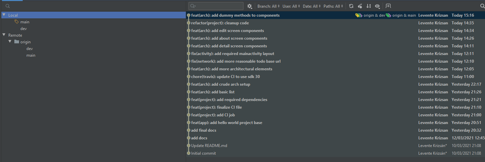
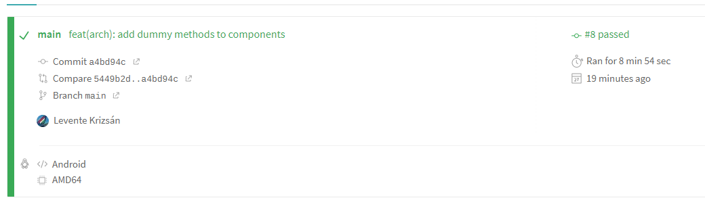

# Architecture

## Architecture Choice

For the application's architecture, I chose Rainbowcake, because of the following reasons:
* This architecture appealed to me most in the Mobil Software Systems lecture
* It seemed like a clean, well thought out design
* It is modern and in active development
* It has been used in many production-grade apps
* The developer is from BME and is a nice guy

Although RainbowCake might be a bit overkill for this project, I wanted to experiment with it, because it seems useful to be familiar with it for future projects.

## Dependency Injection

RainbowCake provides support for 2 DI frameworks at this time: Koin and Dagger 2. For this project, I chose Dagger 2, as:
* It is a Google product
* It utilizes compile time dependency injection using annotation processing instead of runtime
* Provides a Spring DI-like functionality, with which I am very familiar with
* Can be upgraded to Hilt in the future

I was also contemplating using Hilt for this application, however, as of now, RainbowCake does not support it officially, so I decided to be on the safe side and use a supported library - altough the author has plans to support it in the future, in which case, I am sure that migraition will be very easy.

## Github Flow

For development, I followed the usual Git flow that we learned during this course. For this, a `dev` and a feature branch named `feat/arch` was created, where most of the work was done. When finished, `feat/arch` was merged into `dev`, then after the final polishes, `dev` was merged into `main`. As these merges were of the fast-forward type, these branches do not appear individually, though this might change in the future. This documentation was created on the `main` branch. Below is a screenshot of the commits leading up to the moment of writing.

The Github repository in question can be found [here](https://github.com/klevente/portable-dog-diy).

## Travis CI

Travis was successfully initialized for this project, below is a screenshot proving that it can build the application without errors.

The project's Travis page can be found [here](https://travis-ci.org/github/klevente/portable-dog-diy).