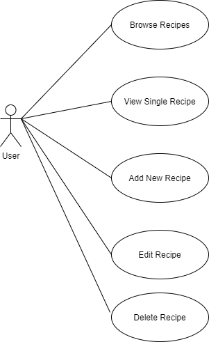
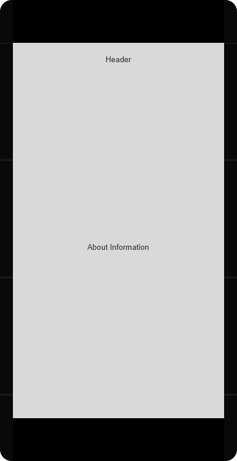
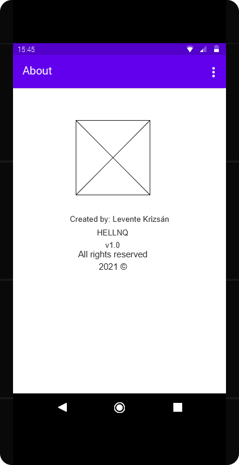

# Portable Dog DIY

## Introduction

Portable Dog DIY is an Android application for browsing and managing Brewdog's beer recipes which have been released to the public. In addition of having access to every Brewdog recipe ever created, the user can also add, delete and edit recipes to further curate their recipe collection. For fetching recipe data, the [Punk API](https://www.brewdog.com/uk/community/diy-dog) service is utilized.

## Functional Requirements

The application must implement the following requirements:
* List the user's recipe collection, with the original Brewdog recipes as a default
* Show a detailed recipe page of a selected entry, with additional information and instructions
* Add a new recipe to the user's list
* Remove a recipe from the user's list
* Edit an already existing recipe in the user's list

## Non-Functional Requirements

In addition to the aforementioned functional requirements, the app must conform to the following additional requirements:
* Query the recipe collection/indivudal recipes from a REST API
* Perform modifications on recipes using the REST API (create, update, delete)
* Provide offline support by caching downloaded data

## User Stories

Formalizing requirements from the user's perspective is also important, as it helps clearing things up when thinking about how the user will interact with the application. The stories below conform to the following pattern: as a *[type of user]* I want to *[perform a task]* so that I can *[achive a goal]*:

* As a user, I want to see all of my recipes, so that I can browse through them
* As a user, I want to see a single recipe, so I can get more info and follow its instruction to brew the beer in question
* As a user, I want to add new recipes, so that I can extend my collection
* As a user, I want to edit recipes, so I can fine-tune them to my preference
* As a user, I want to delete recipes, so I can only keep the ones I like

<div style="page-break-after: always;"></div>

## Use-case Diagram

<p align="center">

</p>

## Wireframes

### Content Wireframes

<p align="center">



</p>

<div style="page-break-after: always;"></div>

### Lo-Fi Wireframes

<p align="center">


</p>

<p align="center">



</p>

<div style="page-break-after: always;"></div>

## Preliminary Data Model

The designed data model is based on the [API](https://punkapi.com/documentation/v2) which hosts the beer recipes, with some simplifications to remove unnecessary properties which are not used in the application.

```
Volume:
- value: double
- unit: VolumeUnit (l, gal)

Temperature:
- value: double
- unit: TemperatureUnit (C, F)

Mass:
- value: double
- unit: MassUnit (kg, g, lbs)

Beer:
- id: int
- name: string
- tagline: string
- description: string
- image_url: string
- abv: double
- ibu: int
- og: int
- fg: int
- volume: Volume
- boilVolume: Volume
- yeast: string
- malts: Malt[]
- hops: Hop[]
- mash: Mash[]
- fermentation: Temperature

Malt:
- name: string
- amount: Mass

Hop:
- name: string
- amount: Mass
- add: string

Mash:
- temperature: Temperature
- duration: int
```